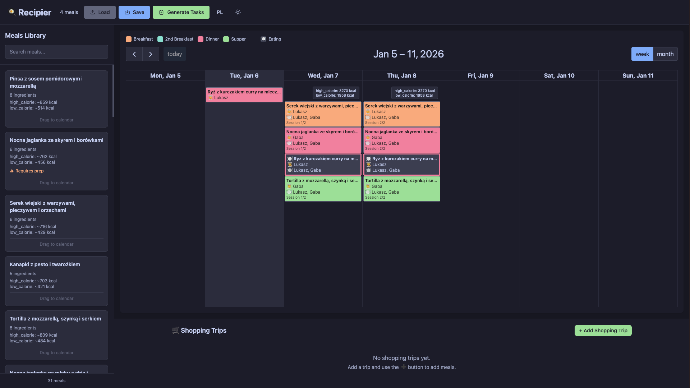

<div align="center">

# 🍳 Recipier

### Smart Meal Planning to Todoist Integration

**Transform your meal plans into organized Todoist tasks with drag-and-drop simplicity**

[](https://www.python.org/downloads/)
[](https://github.com/lukaszsroka/recipier/actions/workflows/tests.yml)
[](LICENSE)
[](DOCKER.md)
[](https://fastapi.tiangolo.com/)
[](https://react.dev/)

[Features](#features) • [Quick Start](#quick-start) • [Documentation](#documentation) • [Architecture](#architecture) • [Contributing](#contributing)

</div>

---

## 📸 Screenshot

<div align="center">



*Recipier web interface: drag-and-drop meal planning with calorie tracking, searchable recipe library, and smart shopping trip management*

</div>

---

## ✨ Features

<table>
<tr>
<td width="50%">

### 🎯 Core Features
- **🖱️ Drag & Drop Interface** - Visual meal planning with FullCalendar
- **📚 Reusable Recipes** - Centralized meals database
- **🔥 Calorie Tracking** - Automatic calculations for 140+ ingredients
- **⚖️ Smart Portion Scaling** - Person-specific serving multipliers
- **🌍 Bilingual** - Polish & English with instant switching
- **🐳 Docker Ready** - Single-command deployment

</td>
<td width="50%">

### 🛠️ Advanced Features
- **🔄 Eating Dates System** - Track when meals are eaten vs. cooked
- **🛒 Smart Shopping Lists** - Categorized with auto-multipliers
- **👥 Multi-Person Support** - Different portions per person
- **📅 Flexible Cooking** - Meal prep or separate sessions
- **🎨 Catppuccin Theme** - Beautiful dark/light mode
- **🔌 Modular API** - Extensible adapter pattern

</td>
</tr>
</table>

---

## 🚀 Quick Start
#-quick-start

### Option 1: Docker (Recommended)

```bash
# Pull and run (production-ready)
docker run -d -p 8000:8000 \
  -e TODOIST_API_TOKEN='your_token_here' \
  -v $(pwd)/data:/app/data \
  lukaszsroka/recipier:latest

# Access at http://localhost:8000
```

<details>
<summary>📦 Or build from source</summary>

```bash
# Clone repository
git clone https://github.com/lukaszsroka/recipier.git
cd recipier

# Build and run with Docker Compose
export TODOIST_API_TOKEN='your_token'
docker-compose up -d

# View logs
docker-compose logs -f
```

See [DOCKER.md](./DOCKER.md) for advanced Docker configuration.

</details>

### Option 2: Local Development

<details>
<summary>🔧 Setup for development</summary>

**Prerequisites**: Python 3.10+, Node.js 18+

```bash
# 1. Install dependencies
uv sync

# 2. Start backend (Terminal 1)
uv run recipier-backend

# 3. Start frontend (Terminal 2)
uv run recipier-frontend

# 4. Open browser
open http://localhost:5173
```

**Get Todoist API Token**:
1. Visit [Todoist Settings → Integrations → Developer](https://todoist.com/app/settings/integrations/developer)
2. Copy your API token
3. Paste in Settings ⚙️ or export as `TODOIST_API_TOKEN`

</details>

### Option 3: CLI Tools

<details>
<summary>🖥️ Command-line interface</summary>

```bash
# Install
uv sync

# Set API token
export TODOIST_API_TOKEN='your_token_here'

# Interactive meal planning
uv run recipier-generate

# Or use existing meal plan
uv run recipier meal_plan.json meals_database.json

# With custom config
uv run recipier meal_plan.json meals_database.json --config my_config.json
```

</details>

---

## 📖 Documentation

<table>
<tr>
<td width="33%">

### 🎓 Getting Started
- [Installation Guide](#quick-start)
- [Web Interface Tutorial](docs/WEB_INTERFACE.md)
- [CLI Usage](#option-3-cli-tools)
- [Configuration Guide](#configuration)

</td>
<td width="33%">

### 🏗️ Architecture
- [System Overview](#architecture)
- [Adapter Pattern](#adapter-pattern)
- [Data Model](#data-model)
- [API Reference](#api-endpoints)

</td>
<td width="33%">

### 📚 Resources
- [Docker Deployment](DOCKER.md)
- [Schema Docs](#schemas)
- [Localization](#localization)
- [Contributing](#contributing)

</td>
</tr>
</table>

---

## 🏗️ Architecture

### System Overview

```
┌─────────────────────────────────────────────────────────┐
│                   Frontend (React)                      │
│  Calendar • Meals Library • Shopping Manager • Settings │
└────────────────────┬────────────────────────────────────┘
                     │ REST API
┌────────────────────▼────────────────────────────────────┐
│                 Backend (FastAPI)                       │
│     Validation • Expansion • Task Generation API        │
└────────────────────┬────────────────────────────────────┘
                     │
        ┌────────────┼────────────┐
        │            │            │
┌───────▼──────┐ ┌──▼─────────┐ ┌▼──────────────┐
│ Meal Planner │ │  Meals DB  │ │ Config System │
│ (Core Logic) │ │ (Recipes)  │ │  (Settings)   │
└──────┬───────┘ └────────────┘ └───────────────┘
       │
┌──────▼─────────┐
│ Todoist Adapter│ ──► 📝 Todoist Tasks
└────────────────┘
```

### Adapter Pattern

The core business logic is decoupled from external integrations:

```python
meal_planner.py → Task objects → todoist_adapter.py → Todoist API
                                → notion_adapter.py → Notion API
                                → custom_adapter.py → Your System
```

This allows easy integration with different task management systems.

---

## 📊 Data Model

### Eating Dates System

Track **when** meals are eaten, not just portions:

```json
{
  "eating_dates_per_person": {
    "John": ["2026-01-06", "2026-01-07", "2026-01-08"],
    "Jane": ["2026-01-06", "2026-01-07"]
  }
}
```

- **1 eating date = 1 portion eaten**
- **Cooking tasks**: Show who eats on cooking day
- **Serving tasks**: Created for non-cooking eating dates
- **Calendar**: Shows calorie totals per eating date

### Two-File Architecture

<table>
<tr>
<td width="50%">

**📚 Meals Database** (`meals_database.json`)
```json
{
  "meals": [{
    "meal_id": "spaghetti_carbonara",
    "name": "Spaghetti Carbonara",
    "base_servings": {
      "high_calorie": 1.67,
      "low_calorie": 1.0
    },
    "ingredients": [
      {
        "name": "spaghetti",
        "quantity": 100,
        "unit": "g",
        "category": "pantry"
      }
    ]
  }],
  "ingredient_calories": {
    "spaghetti": 371
  }
}
```

</td>
<td width="50%">

**📅 Meal Plan** (`meal_plan.json`)
```json
{
  "scheduled_meals": [{
    "id": "sm_1735920000000",
    "meal_id": "spaghetti_carbonara",
    "cooking_dates": ["2026-01-06"],
    "eating_dates_per_person": {
      "John": ["2026-01-06", "2026-01-07"]
    },
    "meal_type": "dinner",
    "assigned_cook": "John"
  }],
  "shopping_trips": [{
    "shopping_date": "2026-01-05",
    "scheduled_meal_ids": ["sm_1735920000000"]
  }]
}
```

</td>
</tr>
</table>

### Portion Calculation

```
Final Quantity = base_qty × base_servings × num_eating_dates
```

**Example**:
- Base: 100g spaghetti per serving
- `base_servings["high_calorie"]`: 1.67
- `eating_dates_per_person["John"]`: 2 dates
- **Result**: 100g × 1.67 × 2 = **334g**

---

## 📋 Task Generation

### Shopping Tasks

```
🛒 Shopping for (2026-01-06 - 2026-01-10)
• Spaghetti Carbonara x2
• Caesar Salad x3

Subtasks (by category):
□ Produce: 200g lettuce
□ Pantry: 334g spaghetti
□ Meat: 250g bacon
```

### Cooking Tasks

```
🍳 Cook: Spaghetti Carbonara
Dinner for 2026-01-06

Portions:
□ John: 167g spaghetti, 125g bacon (~850 kcal/portion)
□ Jane: 100g spaghetti, 75g bacon (~510 kcal/portion)

🍽️ Eating today: John, Jane
```

### Serving Tasks

```
🍽️ Serve: Spaghetti Carbonara
John: ~850 kcal
Jane: ~510 kcal

👨‍🍳 Cooked by: John
```

---

## ⚙️ Configuration

### Custom Config Example

Create `my_config.json`:

```json
{
  "project_name": "Meal Planning",
  "language": "english",
  "use_emojis": true,
  "shopping_categories": [
    "produce",
    "meat",
    "dairy",
    "pantry",
    "frozen",
    "bakery",
    "beverages",
    "other"
  ],
  "user_mapping": {
    "John": "John Doe",
    "Jane": "Jane Doe"
  },
  "diet_profiles": {
    "John": "high_calorie",
    "Jane": "low_calorie"
  },
  "shopping_priority": 2,
  "prep_priority": 2,
  "cooking_priority": 3,
  "eating_priority": 3
}
```

### Priorities

- `1` = Urgent (P1)
- `2` = High (P2)
- `3` = Normal (P3)
- `4` = Low (P4)

---

## 🌍 Localization

Recipier supports **Polish** (default) and **English**:

```json
{
  "language": "english"  // or "polish"
}
```

**What's translated:**
- CLI prompts and questions
- Todoist task titles and descriptions
- Meal type names
- Calendar interface
- Validation error messages

Switch languages instantly using the EN/PL button in the web interface.

---

## 🔌 API Endpoints

### Core Endpoints

<details>
<summary><b>GET</b> /api/meals - List all meals</summary>

```bash
curl "http://localhost:8000/api/meals?search=pasta"
```

Response:
```json
{
  "meals": [{
    "meal_id": "spaghetti_carbonara",
    "name": "Spaghetti Carbonara",
    "base_servings": {...},
    "ingredients": [...]
  }]
}
```

</details>

<details>
<summary><b>POST</b> /api/tasks/generate - Generate Todoist tasks</summary>

```bash
curl -X POST http://localhost:8000/api/tasks/generate \
  -H "Content-Type: application/json" \
  -d '{
    "meal_plan": {
      "scheduled_meals": [...],
      "shopping_trips": [...]
    },
    "todoist_token": "your_token_or_env"
  }'
```

Response:
```json
{
  "success": true,
  "tasks_created": 15,
  "message": "✅ Created 15 tasks in Todoist!"
}
```

</details>

<details>
<summary><b>POST</b> /api/meal-plan/validate - Validate meal plan</summary>

```bash
curl -X POST http://localhost:8000/api/meal-plan/validate \
  -H "Content-Type: application/json" \
  -d @meal_plan.json
```

Response:
```json
{
  "valid": true,
  "errors": []
}
```

</details>

See [Backend Documentation](docs/API.md) for complete API reference.

---

## 📂 Project Structure

```
recipier/
├── 🎨 frontend/              # React + Vite web interface
│   ├── src/
│   │   ├── components/       # React components
│   │   │   ├── Calendar/     # FullCalendar integration
│   │   │   ├── MealsLibrary/ # Draggable meal cards
│   │   │   ├── MealModal/    # Configuration dialog
│   │   │   └── ShoppingManager/
│   │   ├── hooks/            # Custom React hooks
│   │   ├── utils/            # Calorie calculator, etc.
│   │   └── localization/     # Frontend translations
│   └── package.json
│
├── 🔧 backend/               # FastAPI backend
│   ├── main.py              # API entry point
│   ├── routers/             # API endpoints
│   │   ├── meals.py         # Meals database API
│   │   ├── meal_plans.py    # Plan save/load/validate
│   │   ├── tasks.py         # Task generation
│   │   └── config.py        # Configuration API
│   └── models/
│       └── schemas.py       # Pydantic models
│
├── 🧠 recipier/              # Core Python package
│   ├── meal_planner.py      # Business logic (16KB)
│   ├── todoist_adapter.py   # Todoist integration
│   ├── config.py            # Configuration system
│   ├── localization.py      # Python translations
│   ├── create_meal_tasks.py # CLI tool
│   └── generate_meal_plan.py # Interactive generator
│
├── 📊 schemas/               # JSON schemas
│   ├── meals_database_schema.json
│   └── meal_plan_schema.json
│
├── 📝 docs/                  # Documentation
│   ├── WEB_INTERFACE.md
│   ├── API.md
│   └── images/              # Screenshots
│
├── 🐳 Docker/                # Docker configuration
│   ├── Dockerfile
│   ├── docker-compose.yml
│   └── docker-compose.dev.yml
│
├── 📦 data/                  # Generated meal plans
│   └── YYYY-MM-DD.json
│
├── meals_database.json       # Your recipe library
├── my_config.json           # Your configuration
└── pyproject.toml           # Python package config
```

---

## 🤝 Contributing

Contributions are welcome! This is primarily a personal project, but feel free to:

- 🐛 **Report bugs** via [GitHub Issues](https://github.com/lukaszsroka/recipier/issues)
- 💡 **Suggest features** through discussions
- 🔀 **Submit PRs** for improvements
- 📖 **Improve documentation**

### Development Setup

```bash
# Clone
git clone https://github.com/lukaszsroka/recipier.git
cd recipier

# Install dependencies (including test dependencies)
uv sync --dev

# Run tests
pytest                        # Run all tests
pytest -m unit               # Unit tests only
pytest -m api                # API tests only
pytest --cov                 # With coverage report

# Code quality checks
uv run black --check recipier backend tests    # Check formatting
uv run isort --check recipier backend tests    # Check imports
uv run black recipier backend tests            # Auto-fix formatting
uv run isort recipier backend tests            # Auto-fix imports

# Start development servers
uv run recipier-backend      # Backend (Terminal 1)
uv run recipier-frontend     # Frontend (Terminal 2)
```

**Code Quality Standards:**
- Line length: 120 characters
- Formatting: [Black](https://black.readthedocs.io/)
- Import sorting: [isort](https://pycqa.github.io/isort/)
- All code must pass black and isort checks before merging

See [tests/README.md](tests/README.md) for comprehensive testing guide.

---

## 📜 License

MIT License - see [LICENSE](LICENSE) file for details

---

## 🙏 Acknowledgments

Built with:
- [FastAPI](https://fastapi.tiangolo.com/) - Modern Python web framework
- [React](https://react.dev/) - UI library
- [FullCalendar](https://fullcalendar.io/) - Interactive calendar
- [Todoist API](https://developer.todoist.com/) - Task management
- [Catppuccin](https://github.com/catppuccin/catppuccin) - Beautiful color scheme
- [uv](https://github.com/astral-sh/uv) - Fast Python package manager
- [Black](https://black.readthedocs.io/) - Code formatter
- [isort](https://pycqa.github.io/isort/) - Import sorter

---

<div align="center">

**[⬆ Back to Top](#recipier)**

Made with ❤️ by [Łukasz Sroka](https://github.com/louqash)

</div>
